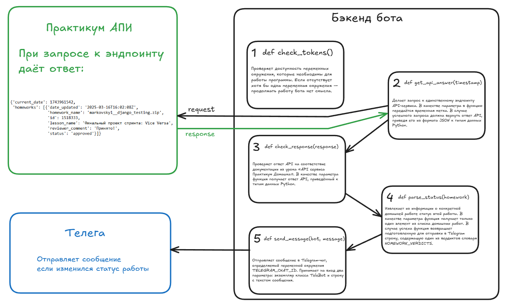

# Telegram Bot для проверки статуса проектов

Этот Telegram-бот автоматически отслеживает статус проверки ваших домашних работ на образовательной платформе Яндекс.Практикум. Он периодически опрашивает API сервиса и присылает уведомления об изменении статуса прямо в Telegram.

## Функциональность

*   **Автоматическая проверка статуса:** Бот каждые 10 минут запрашивает информацию о ваших домашних работах за последнюю неделю.
*   **Умные уведомления:** Отправляет сообщение в Telegram только при изменении статуса работы (например, «взято в ревью», «принято», «требуются доработки»).
*   **Обработка ошибок:** Бот умеет обрабатывать различные ошибки (проблемы с сетью, недоступность API, неожиданный формат ответа) и уведомляет вас о критических сбоях.
*   **Защита от спама:** При повторяющихся ошибках бот отправит уведомление только один раз, чтобы не засорять чат.

## Установка и настройка

1.  **Клонируйте репозиторий** (или скопируйте файлы проекта):
    ```bash
    git clone <your-repo-url>
    cd <your-project-directory>
    ```

2.  **Установите зависимости:** 
    ```bash
    pip install -r requirements.txt
    ```


3.  **Настройте переменные окружения:**
    Создайте файл `.env` в корневой директории проекта и добавьте в него следующие переменные.
    ```ini
    # Обязательные токены
    PRACTICUM_TOKEN=<Ваш_токен_от_аккаунта_на_Практикуме>
    TELEGRAM_TOKEN=<Токен_вашего_Telegram_бота>
    TELEGRAM_CHAT_ID=<ID_вашего_Telegram_чата>
    ```
    *   **`TELEGRAM_TOKEN`**: Как получить:
        1.  Найти в Telegram бота `@BotFather`.
        2.  Отправить команду `/newbot`.
        3.  Следовать инструкциям, чтобы получить токен.
    *   **`TELEGRAM_CHAT_ID`**: Как получить:
        1.  Найти в Telegram бота `@userinfobot`.
        2.  Отправить ему команду `/start`.
        3.  Бот ответит, указав ваш `Id`.

4.  **Запустите бота:**
    ```bash
    python homework.py
    ```

## Как это работает



1.  **Старт:** Бот проверяет наличие всех необходимых токенов. При их отсутствии работа завершается с критической ошибкой.
2.  **Цикл запросов:** Бот входит в бесконечный цикл:
    *   Делает запрос к API Яндекс.Практикума (`ENDPOINT`).
    *   Проверяет ответ на корректность и соответствие документации.
    *   Если в ответе есть новая домашняя работа с обновлённым статусом, извлекает её название и вердикт.
    *   Формирует и отправляет читаемое сообщение в Telegram-чат.
    *   Запоминает время последнего обновления, чтобы не дублировать сообщения.
    *   Логирует все свои действия.
    *   Если происходит любая ошибка (сеть, API, парсинг), бот логирует её и отправляет уведомление в Telegram (но только если текст ошибки изменился).
3.  **Ожидание:** После каждой итерации бот «засыпает» на время, указанное в `RETRY_PERIOD` (по умолчанию 600 секунд = 10 минут), и затем процесс повторяется.

